# UAS_PemrogramanWeb1

## PROFIL

| Variable           | Isi                       |
| ------------------ | ------------------------- |
| **Nama**           | Ahmad Ridho Septian       |
| **NIM**            | 312310447                 |
| **Kelas**          | TI.23.A.5                 |
| **Mata Kuliah**    | Pemrograman Web 1         |
| **Dosen Pengampu** | Eko Budiarto S.kom, M.kom |

---

# 🍚 Jejak Rasa Nusantara ✈️

**Deskripsi Singkat**

Jejak Rasa Nusantara adalah sebuah platform berbasis web yang menampilkan berbagai makanan dan minuman khas Nusantara. Proyek ini bertujuan untuk memperkenalkan keragaman kuliner Indonesia kepada masyarakat luas dengan cara yang menarik dan interaktif.

---

# Fitur Utama

## 🏠 Halaman Home Jejak Rasa Nusantara

Menampilkan informasi umum dan pengantar tentang Jejak Rasa Nusantara.

---

### Tampilan Halaman Home

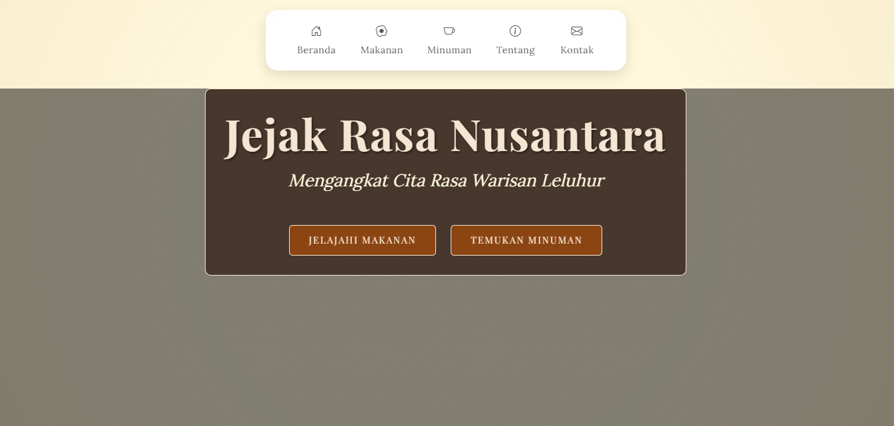
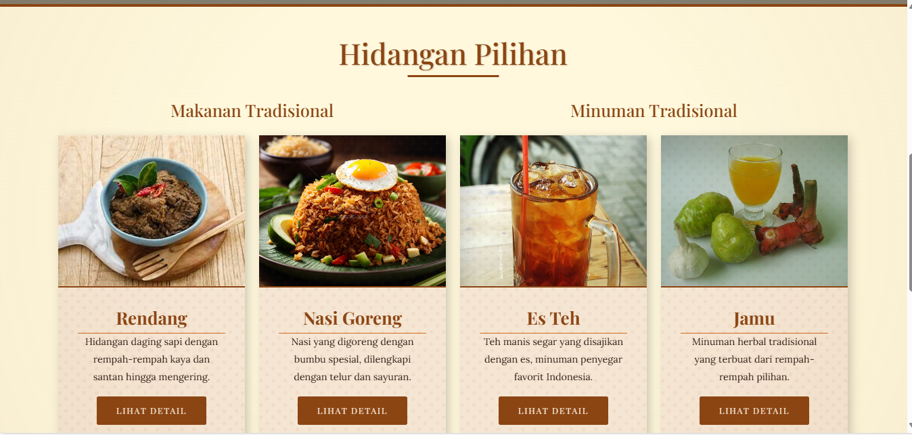
Halaman Home dari proyek "Jejak Rasa Nusantara" merupakan halaman utama yang dirancang untuk memperkenalkan platform ini kepada pengguna. Halaman ini terdiri dari beberapa bagian utama:

**1. Hero Section**

- 🌏✨ (Menjelajahi rasa Nusantara dengan keindahan dan daya tarik)
- 🍴🍹 (Mengajak untuk mencoba makanan dan minuman)

**2. Culinary Showcase**

- 🍛 (Makanan tradisional seperti Rendang dan Nasi Goreng)
- 🍵 (Minuman segar seperti Es Teh dan Jamu)

**3. Footer**

- 🥘🇮🇩 (Melestarikan kelezatan kuliner Indonesia)
- ©️📜 (Hak cipta dan penghargaan terhadap budaya)

Halaman ini menggunakan Bootstrap untuk tata letak yang responsif, Google Fonts untuk tampilan yang modern, serta PHP untuk mengisi konten secara dinamis. Desainnya simpel namun elegan, memberikan pengalaman yang mudah dan menarik bagi pengguna.

---

## 🍛 Halaman Makanan Jejak Rasa Nusantara

Halaman ini menampilkan daftar makanan khas Nusantara beserta deskripsinya. Data disajikan dalam bentuk tabel dan mendukung fungsi CRUD (Create, Read, Update, Delete).

---

### Tampilan Halaman Makanan

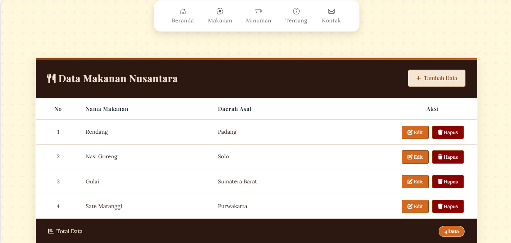

---

#### 1. Header Halaman

- **Judul Halaman:**
  - Menampilkan judul **"Data Makanan Nusantara"** dilengkapi dengan ikon `fa-utensils` (simbol alat makan).
- **Tombol "Tambah Data":**
  - Terletak di sebelah kanan header.
  - Mengarahkan pengguna ke halaman **makananAdd** dengan parameter query string `?page=makananAdd`.
  - Memungkinkan pengguna untuk menambahkan data baru ke dalam daftar.

#### 2. Tabel Data

Tabel digunakan untuk menampilkan daftar data makanan dengan kolom sebagai berikut:

- **No:** Menampilkan nomor urut data.
- **Nama Makanan:** Nama makanan khas Nusantara.
- **Daerah Asal:** Informasi mengenai asal daerah makanan tersebut.
- **Aksi:** Tombol untuk melakukan tindakan seperti mengedit dan menghapus data.

**Catatan:**

- Jika tidak ada data yang tersedia, tabel akan menampilkan pesan:
  - **"Tidak ada data tersedia"**

#### 3. Total Data

Bagian bawah halaman menampilkan total jumlah data makanan yang ada dalam database.

- **Jumlah Data:**
  - Diambil dengan menghitung jumlah baris hasil query SQL (`mysqli_num_rows($sql)`).
- **Tampilan Total Data:**
  - Ditampilkan menggunakan badge dengan warna biru (bootstrap class `badge bg-primary`).

### Fitur CRUD

Halaman ini mendukung fungsi CRUD sebagai berikut:

1. **Create (Tambah Data):**

   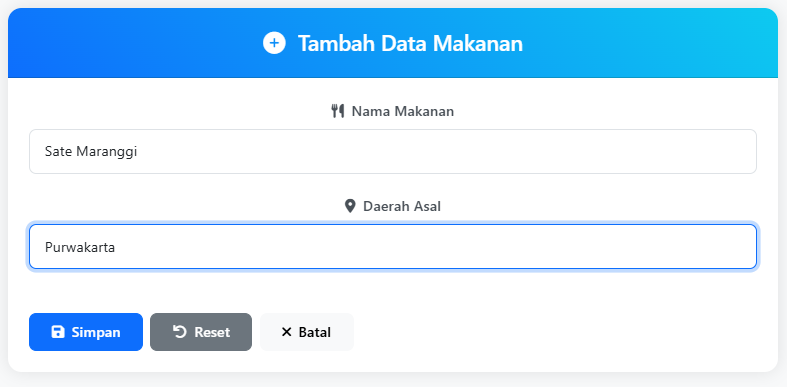

   - Tombol **"Tambah Data"** mengarahkan pengguna ke form untuk menambahkan data makanan baru.

2. **Read (Baca Data):**

   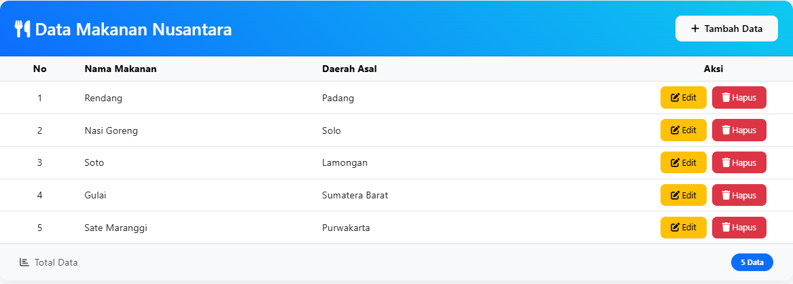

   - Data ditampilkan dalam bentuk tabel yang memuat informasi makanan khas Nusantara.

3. **Update (Edit Data):**

   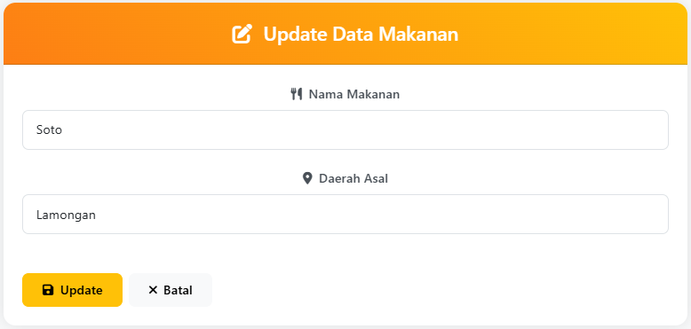

   - Tombol **"Edit"** di kolom Aksi memungkinkan pengguna memperbarui data makanan.

4. **Delete (Hapus Data):**

   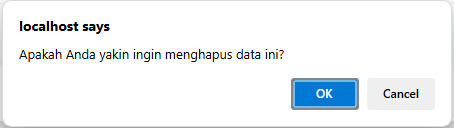

   - Tombol **"Hapus"** dilengkapi dengan konfirmasi untuk mencegah penghapusan data secara tidak sengaja.

---

## 🍹Halaman Minuman Jejak Rasa Nusantara

Halaman ini menampilkan daftar minuman khas Nusantara beserta deskripsinya. Data disajikan dalam bentuk tabel dan mendukung fungsi CRUD (Create, Read, Update, Delete).

---

### Tampilan Halaman Minuman

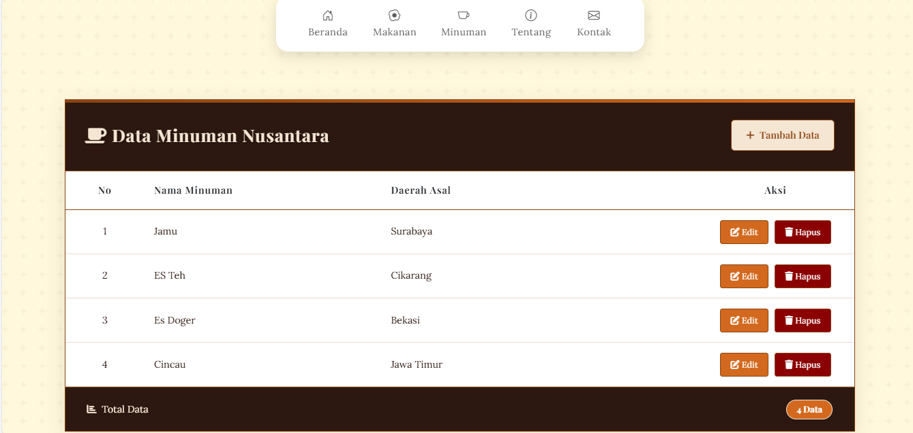

---

#### 1. Header Halaman

- **Judul Halaman:**
  - Menampilkan judul **"Data Minuman Nusantara"** dilengkapi dengan ikon `fa-coffe` (simbol minuman).
- **Tombol "Tambah Data":**
  - Terletak di sebelah kanan header.
  - Mengarahkan pengguna ke halaman **makananAdd** dengan parameter query string `?page=minumanAdd`.
  - Memungkinkan pengguna untuk menambahkan data baru ke dalam daftar.

#### 2. Tabel Data

Tabel digunakan untuk menampilkan daftar data minuman dengan kolom sebagai berikut:

- **No:** Menampilkan nomor urut data.
- **Nama Minuman:** Nama minuman khas Nusantara.
- **Daerah Asal:** Informasi mengenai asal daerah minuman tersebut.
- **Aksi:** Tombol untuk melakukan tindakan seperti mengedit dan menghapus data.

**Catatan:**

- Jika tidak ada data yang tersedia, tabel akan menampilkan pesan:
  - **"Tidak ada data tersedia"**

#### 3. Total Data

Bagian bawah halaman menampilkan total jumlah data minuman yang ada dalam database.

- **Jumlah Data:**
  - Diambil dengan menghitung jumlah baris hasil query SQL (`mysqli_num_rows($sql)`).
- **Tampilan Total Data:**
  - Ditampilkan menggunakan badge dengan warna biru (bootstrap class `badge bg-primary`).

### Fitur CRUD

Halaman ini mendukung fungsi CRUD sebagai berikut:

1. **Create (Tambah Data):**

   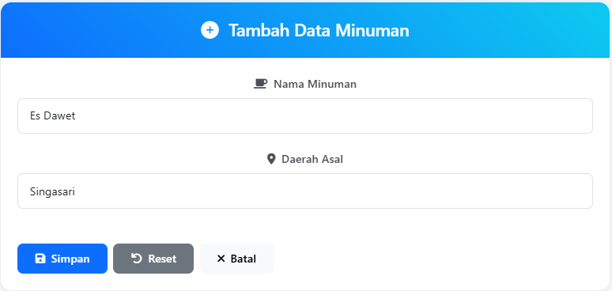

   - Tombol **"Tambah Data"** mengarahkan pengguna ke form untuk menambahkan data minuman baru.

2. **Read (Baca Data):**

   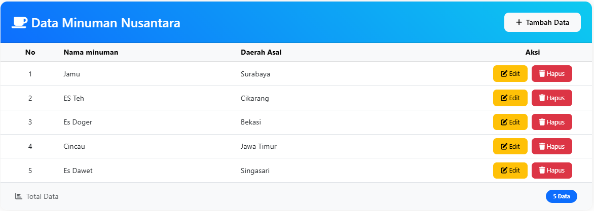

   - Data ditampilkan dalam bentuk tabel yang memuat informasi minuman khas Nusantara.

3. **Update (Edit Data):**

   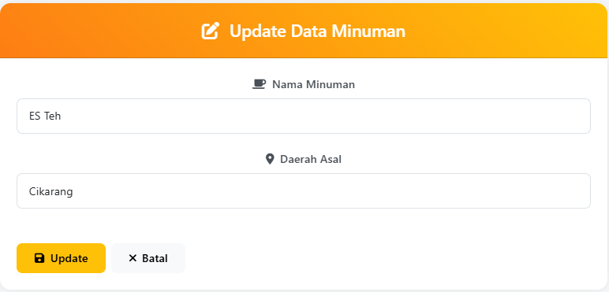

   - Tombol **"Edit"** di kolom Aksi memungkinkan pengguna memperbarui data minuman.

4. **Delete (Hapus Data):**

   

   - Tombol **"Hapus"** dilengkapi dengan konfirmasi untuk mencegah penghapusan data secara tidak sengaja.

---

## 📖 Halaman About Jejak Rasa Nusantara

Halaman **About** ini memberikan informasi tentang platform kuliner yang menghubungkan pencinta makanan dengan berbagai hidangan autentik dari seluruh Indonesia.

---

### Tampilan Halaman About

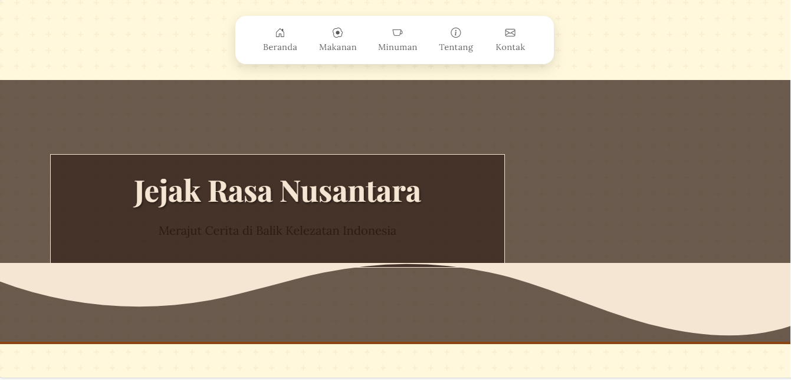
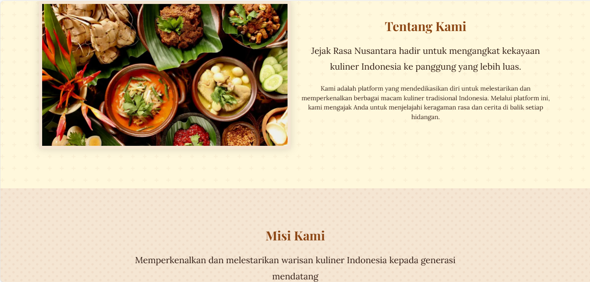
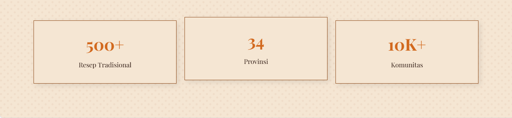

---

1. **Hero Section**

   - Menampilkan gambar latar belakang yang menggambarkan restoran atau kuliner Indonesia.
   - Judul besar "Temukan Jejak Rasa Nusantara" dan subjudul "Menghadirkan pengalaman kuliner autentik dengan sentuhan modern" untuk menarik perhatian pengunjung.

2. **About Section**

   - Menjelaskan visi dan misi dari Culinary Journey, yang berkomitmen untuk melestarikan warisan kuliner Indonesia, mendukung UMKM kuliner lokal, dan menghadirkan inovasi dalam penyajian.
   - Terdapat gambar restoran sebagai ilustrasi.

3. **Features Section**

   - Menyoroti keunggulan-keunggulan utama dari platform ini, seperti:
     - **Kualitas Premium**: Bahan-bahan berkualitas tinggi untuk setiap hidangan.
     - **Chef Berpengalaman**: Chef profesional dengan pengalaman internasional.
     - **Pelayanan Terbaik**: Fokus pada kepuasan pelanggan.

4. **Stats Section**
   - Menampilkan statistik yang menggambarkan kesuksesan Culinary Journey, termasuk jumlah resep makanan, chef profesional, cabang restoran, dan pelanggan puas.

---

## 📧 Halaman Contact Jejak Rasa Nusantara

Website **Jejak Rasa Nusantara** memiliki halaman **Kontak Kami** yang memungkinkan pengunjung untuk menghubungi tim kami dengan mudah. Halaman ini terdiri dari dua bagian utama: informasi kontak dan formulir kontak.

---

### Tampilan Halaman Contact

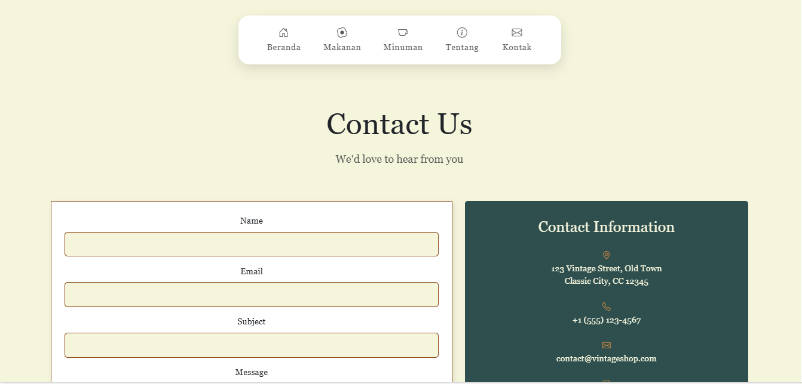
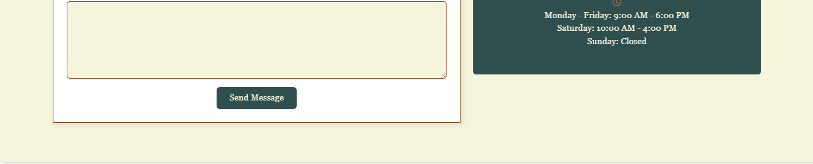
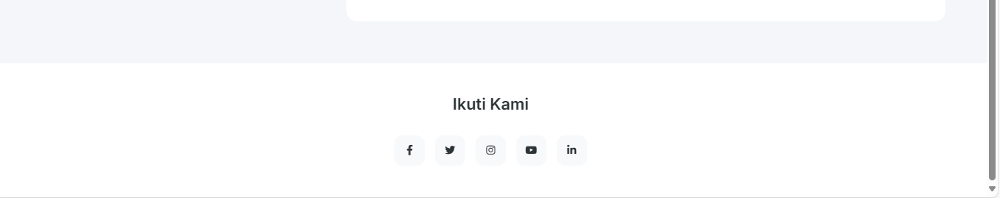

---

#### 1. **Header Halaman**

- Bagian ini menggunakan latar belakang gambar dengan efek gradasi gelap, memberikan kesan profesional dan estetis.
- Menampilkan judul **Hubungi Kami** dan deskripsi singkat yang mengajak pengunjung untuk menghubungi kami melalui berbagai saluran yang tersedia.

#### 2. **Informasi Kontak**

- Bagian ini berisi informasi penting yang terbagi dalam beberapa item kontak, masing-masing menampilkan:

  - **Lokasi Kami**: Alamat lengkap untuk mengunjungi kami.
  - **Telepon**: Nomor telepon yang bisa dihubungi.
  - **Email**: Alamat email untuk pertanyaan atau dukungan lebih lanjut.
  - **Jam Operasional**: Waktu kerja yang dapat dihubungi.

  Setiap item informasi dilengkapi dengan ikon terkait (misalnya, peta untuk lokasi, telepon untuk nomor telepon, dan sebagainya).

#### 3. **Formulir Kontak**

- Pengunjung dapat mengisi **formulir** untuk mengirim pesan kepada kami.

  - **Nama Lengkap**: Untuk mengetahui pengirim pesan.
  - **Email**: Untuk menghubungi kembali pengunjung.
  - **Nomor Telepon**: Sebagai alternatif kontak.
  - **Subjek**: Topik atau alasan pengunjung menghubungi.
  - **Pesan**: Pesan yang ingin disampaikan kepada tim kami.

  Setelah mengisi formulir, pengunjung dapat mengirim pesan menggunakan tombol **Kirim Pesan**.

#### 4. **Bagian Media Sosial**

- Pengunjung dapat mengikuti kami di platform media sosial melalui tautan yang tersedia (Facebook, Twitter, Instagram, YouTube, LinkedIn).

## Teknologi yang Digunakan

Website ini dibangun menggunakan berbagai teknologi modern untuk memberikan pengalaman pengguna yang optimal.

### **Frontend:**

- **HTML5**: Menyusun struktur halaman web yang bersih dan responsif.
- **Bootstrap 5**
- **CSS3**: Mengatur gaya visual, layout, dan responsivitas halaman.
- **JavaScript**: Menangani interaktivitas dan dinamika halaman.

### **Backend:**

- **PHP**: Digunakan untuk menangani proses pengiriman pesan dari formulir kontak.
- **MySQL**: Digunakan untuk menyimpan dan mengelola data pesan yang masuk.

---

## Cara Menggunakan

### Prasyarat

- Pastikan Anda telah menginstall:
  - Node.js dan npm
  - Browser modern (Google Chrome, Firefox, dll.)

### Langkah Instalasi

1. Clone repository:
   ```bash
   git clone https://github.com/username/jejak-rasa-nusantara.git
   ```
2. Masuk ke direktori proyek:
   ```bash
   cd jejak-rasa-nusantara
   ```
3. Install dependencies:
   ```bash
   npm install
   ```
4. Jalankan aplikasi:
   ```bash
   npm start
   ```
5. Buka browser Anda dan akses:
   ```
   http://localhost:3000
   ```

## Cara Berkontribusi

1. Fork repository ini.
2. Buat branch fitur Anda: `git checkout -b fitur/fitur-baru`.
3. Commit perubahan Anda: `git commit -m 'Menambahkan fitur baru'`.
4. Push ke branch Anda: `git push origin fitur/fitur-baru`.
5. Buat Pull Request di repository utama.

## Lisensi

Proyek ini menggunakan lisensi [Lisensi Anda]. Lihat file [LICENSE](./LICENSE) untuk detail lebih lanjut.

## Kontak

Jika ada pertanyaan atau masalah terkait proyek ini, silakan hubungi:

- Nama: Ahmad Ridho Septian
- Email: ahmadridhoseptian388@gmail.com
- GitHub: [dhosptn](https://github.com/dhosptn)
